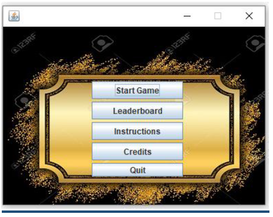
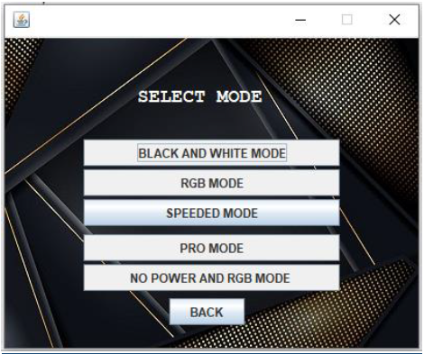
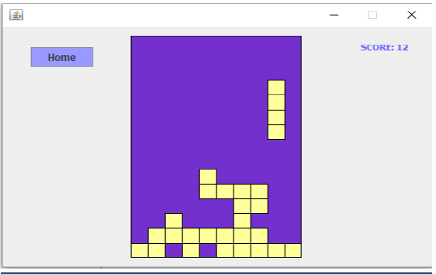
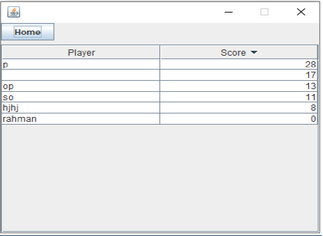
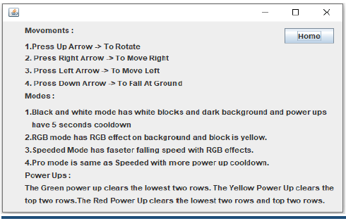

# 🎮 Tetris Game (Java)

A feature-rich **Tetris game** developed in **Java Swing**. 
This project recreates the classic Tetris gameplay while extending it with **multiple game modes, power-ups, and a dynamic leaderboard system**.

---

## 📌 Project Overview

Tetris is a tile-matching video game originally created by **Alexey Pajitnov (1984)**.  
This Java-based implementation focuses on **entertainment, logical thinking, and cognitive engagement**, as studies show that playing Tetris can help improve brain efficiency.

The game challenges players to align falling blocks into complete horizontal rows while managing speed, modes, and special power-ups.

---

## 🛠️ Technology Stack

- **Language:** Java  
- **GUI Framework:** Java Swing  
- **IDE:** NetBeans 12.2  
- **Data Structures:** 2D Arrays  

---

## ✨ Key Features

### 🔹 Start-Up Menu
The game starts with a user-friendly menu containing:
- ▶️ Start Game  
- 🏆 Leaderboard  
- 📖 Instructions  
- 👥 Credits  
- ❌ Quit  

---

### 🔹 Multiple Game Modes (5 Modes)

1. **Black & White Mode**
   - Dark background
   - White blocks
   - Power-up cooldown: 5 seconds

2. **RGB Mode**
   - Colorful RGB background
   - Yellow blocks

3. **Speeded Mode**
   - Faster falling blocks
   - RGB background

4. **Pro Mode**
   - Increased difficulty
   - Power-up cooldown: 10 seconds

5. **No Power RGB Mode**
   - No power-ups
   - Only full-row completion clears lines

---

### 🔹 Block System
- **10 different block types**
  - 7 standard Tetris blocks
  - 3 special **power-up blocks**
- Blocks are generated and managed using **2D arrays**

---

### 🔹 Power-Ups
- 🟢 **Green Block:** Clears the bottom two rows  
- 🟡 **Yellow Block:** Clears the top two rows  
- 🔴 **Red Block:** Clears both top and bottom two rows  

---

### 🔹 Scoring System
- Each cleared grid = **1 point**
- Example:
  - Clearing 1 full row (10 grids) → **10 points**
- Power-up cleared grids are also counted in scoring

---

### 🔹 Leaderboard System
- Player name is taken after game over
- Scores are saved and displayed
- Leaderboard can be sorted in:
  - Ascending order
  - Descending order

---

## 📸 Screenshots

### 🎮 Main Menu

### 🧩 Gameplay Modes

### ✨ GameLook

### 🏆 Leaderboard

### 📃 Instructions

---

## 🎨 Game Interface
- Visual design changes based on selected mode
- High-contrast black & white mode
- Colorful RGB modes for enhanced engagement
- Designed to keep players visually interested

---

